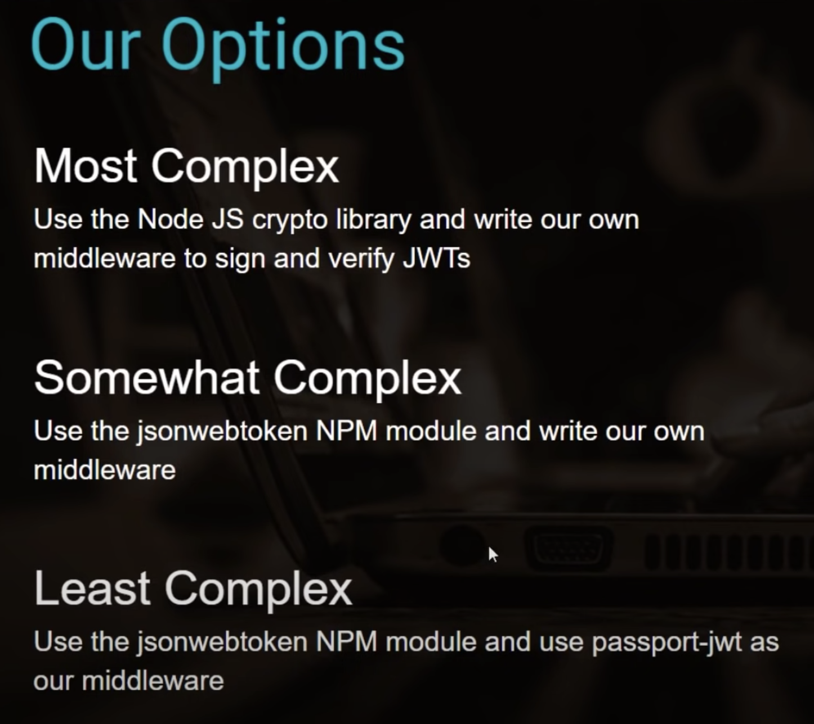

# Passport JWT Strategy

[Passport JWT Strategy Documentation](https://www.passportjs.org/packages/passport-jwt/)

#### The JWT Authentication Process:
JSON Web Tokens (JWT) is a popular method for authentication and authorization in web applications. The JWT authentication process works as follows:

1. Client sends a login request to the server with credentials (e.g., username and password).

2. The server verifies the credentials and, if they are valid, creates a JSON Web Token that contains information about the user, such as their name and role, and a signature.

3. The server sends the JWT to the client, usually as an HTTP response header.

4. The client stores the JWT and sends it with every subsequent request to the server.

5. The server uses the signature to verify that the token was not tampered with and that it was issued by a trusted source.

6. If the token is valid, the server decodes it to extract the user information and grants access to the requested resources based on the user's role and permissions.

7. If the token is invalid or expired, the server denies access and sends an error response.

In summary, JWT provides a way for the client and server to securely exchange information about the user and ensures that only the server can grant access to the protected resources.

