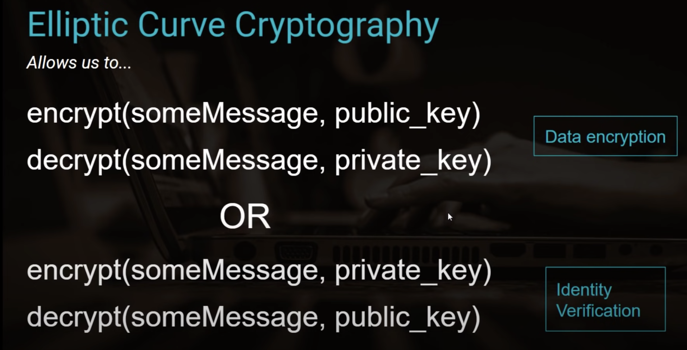

# User Authentication in Web Apps:

Technologies Used:

[BAD DOCUMENTATION! Passport JS Local Strategies](https://www.passportjs.org/packages/passport-local/)

[BETTER DOCUMENTATION! Passport Username & Password](https://www.passportjs.org/howtos/password/)

### Passport Local Strategy MongoDB Atlas & Mongoose

### Public Key Cryptography 

Public Key Cryptography is asymmetric b/c we have public and private key associated with it.

Symmetric cryptography is identified by a single key.

1. Encrypt Data:
- [x] Encrypt with PUBLIC key
- [x] Decrypt with PRIVATE key

1. Verify Identities
- [x] Encrypt with PRIVATE key
- [x] Decrypt with PUBLIC key

##### "Trap Door" Functions

- [x] Deterministic
- [x] One-Way
- [x] Large number space
- [x] Small enough to transport over HTTP

##### Elliptic Curve Cryptography

- [x] The basis of public key cryptography
- [x] Is a "Trap Door" function
- [x] Mathematically links the private and public keys

